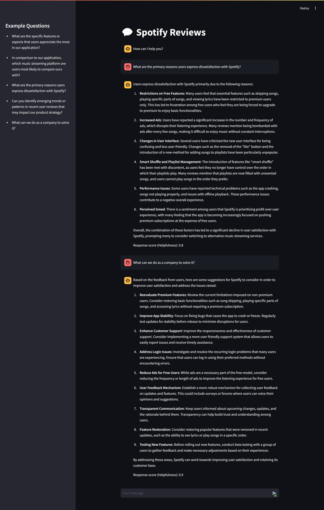

# Q&A RAG Chatbot

This project is a Question-Answering (Q&A) Retrieval-Augmented Generation (RAG) Chatbot designed to help analyze and respond to questions about user feedback from Spotify reviews. The chatbot leverages LLM and retrieval techniques to gather relevant context from a database of reviews, enhancing its ability to generate informed, contextually accurate answers and deliver insightful responses to a range of management queries and analysis.

## Preview


## Architecture
- Framework: LangChain
- LLM: OpenAI GPT4
- Embeddings: OpenAI Embeddings
- Vector Stores: Zilliz (Milvus)
- User Interface: Streamlit

## Installation
Required Python 3.x to install. The development environment uses Python 3.12.

Use the package manager [poetry](https://python-poetry.org/) to install required packages.

```bash
pip install poetry
```
Run below command to let [poetry](https://python-poetry.org/) install all the packages.
```bash
poetry install
```

## Usage
### Application
Get inside the environment.
```bash
poetry shell
```
Don't forget to fill in the environment variables. Then run the application.
```bash
streamlit run app.py
```
### Data Ingestion
If the vector store is fresh and empty and need to ingest raw data into the vector store, then run the following command. Make sure the dataset is in the correct filepath.
```bash
python src/data/dataset_preprocessing.py
python src/data/data_ingestion.py
```


## Repository Structure
```python
├── dataset/
│   ├── .gitkeep
│   └── SPOTIFY_REVIEWS.csv          # Spotify reviews dataset
├── src
│   ├── app
│   │   ├── evaluator.py             # LLM-as-a-judge evaluator 
│   │   └── rag_chatbot.py           # Main class of the RAG LLM workflow
│   └── data
│   │   ├── data_ingestion.py        # Script to ingest the preprocessed data into vector store
│   │   └── dataset_preprocessing.py # Script to preprocess the raw data
├── .env.example                     # Environment variables example. Copy this, rename it to .env, and fill in the variables
├── .gitignore
├── README.md
├── app.py                           # Serve inference and streamlit user interface
├── poetry.lock
└── pyproject.toml
```

## Further Improvements
1. Allow human feedback on the UI to gather RLHF dataset for one-shot prompting or even fine-tuning.
2. Implement query intent classification for qualitative and quantitative query. For qualitative query, it has already implemented based on RAG. For quantitative query it's better to let the LLM generate 'text-to-dataframe' script and execute directly on the dataframe as it will be more precise and cover the whole dataset.